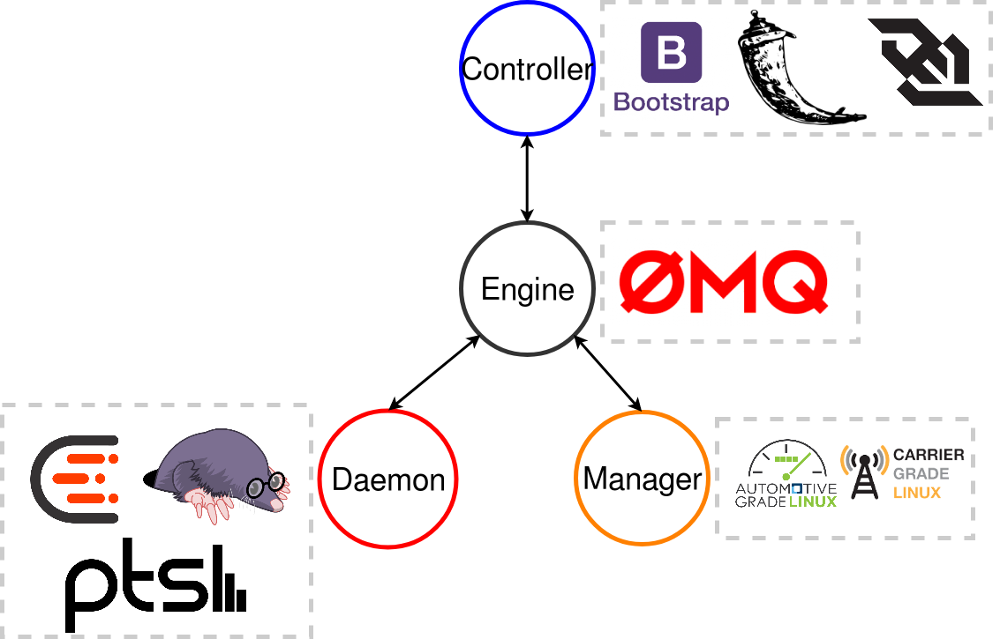

# Ellida

**Yocto integrated automated testing framework for validating result images based on a specification**

Ellida aims to provide automatic testing and validation of Linux distributions
based on a specification. The purpose is to easily evaluate the compliance of a
distribution with a specification. The framework is intended to be used with
Yocto built distributions.

Main components
1. The Engine - communication manager
2. The Daemon - test runner, available on the tested system
3. The Controller - UI, used by a tester to execute tests and receive results
4. The Manager - tool that keeps the internal representation of the
specifications organised and up to date

The framework is intened to parse a specification, download a test suite
specific to that specification, add Yocto specific configurations required for
adding all dependencies (test suites and test control component), execute the
tests remotely and return the results.

Currently supported specs are AGL and CGL.

Ellida is a diploma project, the thesis contents that go into details about the
architecture can be found at [Thesis](https://github.com/VoltBit/diploma-thesis).

[Icons source](http://www.flaticon.com/packs/vikings)

### Installation and usage instructions

The system can be used after:

1. The current repository was cloned
2. The daemon component is installed on the target

Note the requirments.txt file where all or most of the dependencies are included.

To start the system use:

    * ui.py for starting the interface (the controller)
    * engine/ellida_engine.py for starting the engine
    * manager/ellida_manager for starting the manager

The install folder contains the Yocto layer for Ellida and build environment
configuration files.

The install.sh script was used during the development to copy relevant framework
files to the Poky directory structure. Should only be used as reference for the
required files as the paths are hardcoded.

